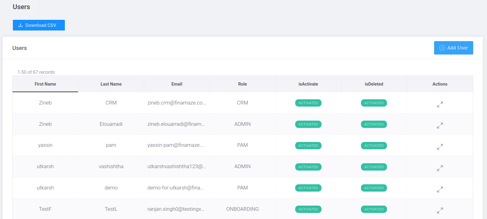
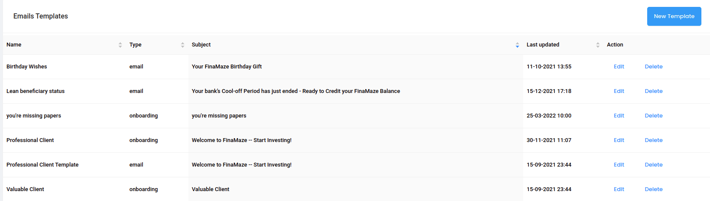

# Admin

### Portal:

- The admin can see the list of all users which contains their (last name, first name, email, Role, isActive, isDeleted, Actions).
plus the possibility of downloading the list by clicking on the Dowload CSV button.

- Admin can click on a specific user's row for the option to Edit, Desactivate, delete, or reset his password

- Admin can add a new user by clicking on the Add User button in top-right

### Permission:

- The admin can see the list of roles already created.

- Admin can click on a specific role and add a list of permissions allowed for it (Ex: ONBOARDING role)

- The admin can modify the description or the list of permissions of each role by clicking on the Edit button in top-right.

### Asset Managers

- The admin can view the list of PAM (personal asset manager) users or search for a PAM by name.

- The admin can see the list of clients (investors) assigned to a specific PAM user.
the liste contains (Full name, Email, Phone number, Client type, Risque grade, Verified).

- The admin can search for a Client by his Fulle Name or Email.

- The admin can assign other client to PAM by clicking on the Assign Clients button in top-right.

### Email Templates

- The admin can view the list of Email templates already created or create a new one by clicking on the New Template button in top-right.

# Client

### Onboarding

- The admin can see the list of all registered clients  and in which ombording step they are, the list contains the following information (First name, Last, name, Created at, Gender, Email, City, Step, Status, Type , Email Verified, Passport, Proof of Address, Assessment, Wealth, KYC).

- The admin can download the list by clicking the Download CSV button.
- Admin can add a new user manually by clicking the Add Client button at the top of the page
  

- The admin can see the profile summary of a specific client which contains the above information.

- In the Client Onboarding section:
   1. Onboarding Steps
    * The admin can see the status of each onboarding step along with the option to edit the step if it is invalid by clicking the Change Onboarding Step button at right.
   
   2. Profile
    * Contains account information plus personal information of the client
   
   3. ID Verification
     * Compare the personal information extracted from the customer's passport with the information on the Omboarding.
     * Display the Passport image of the client
  
   4. Wealth
    

   5. Risk Assessment
     * The information required to analyze a client's investment risk. (Personal Score, Experience Score, wealth Score, Objectives Score, Total Score, Risk Level, Age, Number of dependents, Liquid Net, FinaMaze Portion, Investments Familiarity, Finance Experience, Net Annual Income, Crisis Loss, Net Wealth, TakeProfile / StopLoss).
   6. TAX/PEP
   
   7. Validatoin
       
 The admin can validate the necessary steps to verify the identity of the client.
   8. Client Files
   * contains client documents (ex: Proof Of Address, Proof of wealth, Social media).
  
- In the Client Dashboard section:
  1. Bank Account
   * liste of bank acount used by client
  
  2. Investments
   * Liste of client's investments contains(Inception date, Exit date, Account id, First name, Last name, Smartfolio, Layer, class, Risk Solution, Take Profit, Stop Loss, Residual, Inception[invested, Rebalanced], Live[NAV, Performance]).
   * The investments can be filtred by they status.
   * Admin can see more details (investment info, Holding tickers, Zag orders) about each investment by clicking on his line.
  
  3. Cash
   
  
  4. Holdings
   
    * List of all Tickers invested by the client with their respective quantity.
  
  5. Cash Transactions
  
  6. Statements

- In the Admin Actions section:
  1. Control Panel
   
   * Admin can block / Activate client
   * Add client to CRM (Customer relationship management)
   * Upload client files
   * Reset client password
   * Delet client
  
  2. Send Email
   Admin can choose a specific email template previously created in Admin/Email_Templates to send an email to client.
  
  3. Email History
    List of emails sent to the client.
  
  4. Onboarding History
    

### Active

 
    display the liste of activated client.
    active client: the client who finish the onboarding process and validate the Compliance check list.

### Rejected/Deleted

