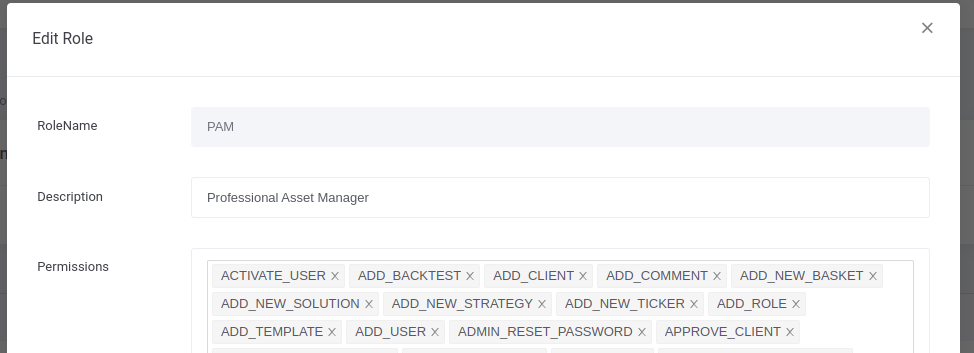

# Admin

### Portal:

The admin can see the list of all users which contains their (last name, first name, email, Role, isActive, isDeleted, Actions).
plus the possibility of downloading the list by clicking on the Dowload CSV button.

Admin can click on a specific user's row for the option to Edit, Desactivate, delete, or reset his password

Admin can add a new user by clicking on the Add User button in top-right

### Permission:

The admin can see the list of roles already created.

admin can click on a specific role and add a list of permissions allowed for it (Ex: ONBOARDING role)

the admin can modify the description or the list of permissions of each role by clicking on the Edit button in top-right.

### Asset Managers

The admin can view the list of PAM (personal asset manager) users or search for a PAM by name.

The admin can see the list of clients (investors) assigned to a specific PAM user.
the liste contains (Full name, Email, Phone number, Client type, Risque grade, Verified).

The admin can search for a Client by his Fulle Name or Email.

the admin can assign other client to PAM by clicking on the Assign Clients button in top-right.

### Email Templates

The admin can view the list of Email templates already created or create a new one by clicking on the New Template button in top-right.

